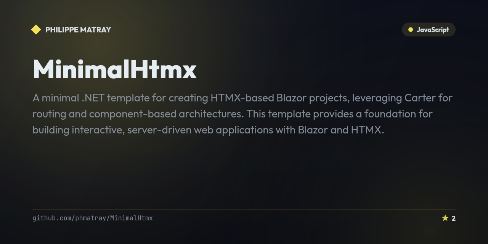

# HtmxDualServer

<!-- portfolio-badges:start -->
<!-- Identity -->
[](https://github.com/phmatray/HtmxDualServer)

[](https://github.com/phmatray/HtmxDualServer/stargazers)
[](https://github.com/phmatray/HtmxDualServer/network/members)

<!-- Activity -->
[](https://github.com/phmatray/HtmxDualServer/issues)
[](https://github.com/phmatray/HtmxDualServer/pulls)
[](https://github.com/phmatray/HtmxDualServer/commits)
<!-- portfolio-badges:end -->

<!-- portfolio-toc:start -->

## Table of Contents

- [Description](#description)
- [Features](#features)
- [Getting Started](#getting-started)
- [Tech Stack](#tech-stack)
- [License](#license)
- [Contributing](#contributing)

<!-- portfolio-toc:end -->


> A dual-server architecture combining Blazor and HTMX for hybrid web applications.

## Description
HtmxDualServer demonstrates a dual-server pattern where a Blazor Shell application works alongside an HTMX-powered API server. This architecture allows teams to progressively adopt HTMX for lightweight hypermedia interactions while keeping Blazor for richer interactive components.

## Features
- Blazor Shell application for rich UI components
- HTMX API server for lightweight server-side rendering
- Docker containerized deployment
- Hybrid hypermedia + SPA architecture

## Getting Started
```bash
git clone https://github.com/phmatray/HtmxDualServer.git
cd HtmxDualServer
dotnet run --project HtmxApi
```

<!-- portfolio-techstack:start -->

## Tech Stack

- **.NET 10**
- TheAppManager
- Microsoft.AspNetCore.OpenApi
- Swashbuckle.AspNetCore

<!-- portfolio-techstack:end -->

## License
MIT

---

<!-- portfolio-sections:start -->

## Contributing

Contributions are welcome. Open an issue first to discuss any significant change.

1. Fork the repository and create your branch (`git checkout -b feat/my-feature`)
2. Commit your changes (`git commit -m 'feat: ...'`)
3. Push the branch and open a Pull Request

<!-- portfolio-sections:end -->
