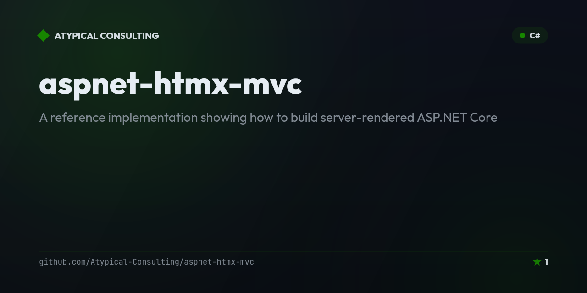

# HtmxMvc

<!-- portfolio-badges:start -->
<!-- Identity -->
[](https://github.com/Atypical-Consulting/aspnet-htmx-mvc)

[](https://github.com/Atypical-Consulting/aspnet-htmx-mvc/stargazers)
[](https://github.com/Atypical-Consulting/aspnet-htmx-mvc/network/members)

<!-- Activity -->
[](https://github.com/Atypical-Consulting/aspnet-htmx-mvc/issues)
[](https://github.com/Atypical-Consulting/aspnet-htmx-mvc/pulls)
[](https://github.com/Atypical-Consulting/aspnet-htmx-mvc/commits)
<!-- portfolio-badges:end -->

<!-- portfolio-toc:start -->

## Table of Contents

- [Highlights](#highlights)
- [Quick start](#quick-start)
- [Usage](#usage)
- [Architecture](#architecture)
- [Module composition](#module-composition)
- [HTMX integration](#htmx-integration)
- [Features](#features)
- [Persistence](#persistence)
- [Tests](#tests)
- [Notes](#notes)
- [Design docs](#design-docs)
- [Tech Stack](#tech-stack)
- [Roadmap](#roadmap)
- [Contributing](#contributing)
- [License](#license)

<!-- portfolio-toc:end -->


A reference implementation showing how to build server-rendered ASP.NET Core
MVC apps with HTMX 2 — **organized by feature, composed by module, persisted
by SQLite, free of client-side JavaScript**.

```
+--------------------+
|   HtmxMvc.Domain   |   Contact, IContactRepository — zero dependencies
+--------------------+
            ^
            |
+-----------+-----------+---------------------+
|                                              |
|  HtmxMvc.Application       HtmxMvc.Infrastructure
|  - handlers per use case   - AppDbContext (EF Core)
|  - DTOs, view models       - EfCoreContactRepository
|                            - DatabaseSeeder
|                                              |
+-----------+-----------+---------------------+
            ^
            |
+--------------------+
|    HtmxMvc.Web     |   AppManager.Start composes IAppModules
| Features/Contacts/ |   Features/Dashboard/
| Http/  TagHelpers/ |   Views/Shared/_Layout.cshtml
+--------------------+
```

## Highlights

| Concern                  | Approach                                                          |
|--------------------------|-------------------------------------------------------------------|
| Architecture             | Hexagonal (ports & adapters). Domain has zero references.         |
| Web project layout       | Feature folders + custom view-location expander.                  |
| Startup composition      | `IAppModule` modules via [TheAppManager][tam]. Each feature owns its DI. |
| HTMX URL safety          | `<button hx-action="Edit" hx-route-id="@id">` tag helper.         |
| Server-driven UI events  | Typed `Response.Htmx(h => h.Trigger("contact-saved"))` builder.   |
| Dual-render              | `Request.IsHtmx()` — same endpoint serves full page or partial.   |
| Persistence              | EF Core 10 + SQLite, `EnsureCreated` + idempotent seed at startup.|
| Antiforgery              | `[AutoValidateAntiforgeryToken]` + body `hx-headers` token.       |
| Tests                    | 60 across Application, Infrastructure, and Web.                   |

[tam]: https://www.nuget.org/packages/TheAppManager

## Quick start

```powershell
dotnet run --project src/HtmxMvc.Web
# Then open the URL Kestrel prints, or pass --urls http://localhost:5099
```

A `htmxmvc.db` SQLite file lands in the working directory on first run
(gitignored). Delete it to reset the database.

```powershell
dotnet test    # 60 tests across the three test projects
```

## Usage

Once `dotnet run --project src/HtmxMvc.Web` is running and you've opened the
printed URL:

- **Contacts** (`/`) — search contacts with live-filtering as you type
  (debounced via `hx-trigger="keyup changed delay:300ms"`), add a new
  contact (the row prepends to the top of the list), click a row to edit it
  inline, save or cancel without a full page reload, and delete a row with
  an `hx-confirm` prompt.
- **Dashboard** (`/dashboard`) — view aggregate contact stats that
  self-refresh every 3 seconds via HTMX polling, and switch the "recent
  contacts" window (5 / 10 / 25) with the tab buttons — the URL updates via
  `Response.Htmx(h => h.PushUrl(...))` without a full navigation.

Every Create / Update / Delete on the Contacts page fires an
`HX-Trigger: contact-saved` event that other elements on the page can react
to (see [HTMX integration](#htmx-integration) above).

## Architecture

The project graph is strictly one-way: Web depends on Application and
Infrastructure, both of which depend only on Domain. Domain has no
dependencies at all.

| Path                              | References                  | Purpose                                          |
|-----------------------------------|-----------------------------|--------------------------------------------------|
| `src/HtmxMvc.Domain/`             | none                        | `Contact` entity, `IContactRepository` port.     |
| `src/HtmxMvc.Application/`        | Domain                      | One handler per use case, write DTOs, view models.|
| `src/HtmxMvc.Infrastructure/`     | Domain                      | EF Core + SQLite adapter, seeder.                |
| `src/HtmxMvc.Web/`                | Application, Infrastructure | Composition root, controllers, views, HTMX kit.  |
| `tests/HtmxMvc.Application.Tests/`| Application, Domain         | Handler logic against a hand-rolled fake repo.   |
| `tests/HtmxMvc.Infrastructure.Tests/` | Infrastructure, Domain  | EF repo + seeder against SQLite `:memory:`.      |
| `tests/HtmxMvc.Web.Tests/`        | Web                         | HTMX request/response helpers.                   |

Application is back to a pure class library — it doesn't even reference
`Microsoft.Extensions.DependencyInjection.Abstractions`. Each feature's
DI lives in Web, next to the controller.

## Module composition

`Program.cs` is four lines:

```csharp
AppManager.Start(args, modules => modules
    .Add<WebHostModule>()
    .Add<InfrastructureModule>()
    .Add<ContactsModule>()
    .Add<DashboardModule>());
```

Every module implements `IAppModule` and overrides only what it needs of
`ConfigureServices` / `ConfigureMiddleware` / `ConfigureEndpoints`. Modules
run in registration order.

| Module                 | Location                              | Responsibility                                            |
|------------------------|---------------------------------------|-----------------------------------------------------------|
| `WebHostModule`        | `Web/`                                | MVC, view-location expander, middleware, `MapControllers`.|
| `InfrastructureModule` | `Web/`                                | Read connection string; `EnsureCreated` + seed at startup.|
| `ContactsModule`       | `Web/Features/Contacts/`              | Register all six contact handlers.                        |
| `DashboardModule`      | `Web/Features/Dashboard/`             | Register `GetDashboardStatsHandler`.                      |

Adding a third feature is one folder under `Features/<Name>/` plus one
line in `Program.cs`. Removing a feature is `rm -rf Features/<Name>/` and
deleting that one line — no scattered registrations to chase.

### Feature folders

A custom `FeatureViewLocationExpander` prepends two paths to MVC's view
search order, so feature views live next to their controller:

```
src/HtmxMvc.Web/
  Features/
    _ViewImports.cshtml       — shared imports (tag helpers, namespaces)
    _ViewStart.cshtml         — Layout = "_Layout"
    Contacts/
      ContactsController.cs
      ContactsModule.cs
      _ViewImports.cshtml     — @using HtmxMvc.Application.Contacts
      Views/
        Index.cshtml
        _ContactList.cshtml
        _ContactRow.cshtml
        _ContactEditRow.cshtml
    Dashboard/
      DashboardController.cs
      DashboardModule.cs
      _ViewImports.cshtml     — @using HtmxMvc.Application.Dashboard
      Views/
        Index.cshtml
        _Stats.cshtml
  Http/                       — IsHtmx() / Response.Htmx() helpers
  TagHelpers/                 — hx-action tag helper
  Views/Shared/_Layout.cshtml — kept where MVC's default expander finds it
```

## HTMX integration

Three small primitives in `Http/` and `TagHelpers/` carry the entire
HTMX story.

### 1. The `hx-action` tag helper

Views write the action name, not the URL:

```html
<button hx-action="Edit"
        hx-route-id="@Model.Id"
        hx-target="#contact-@Model.Id"
        hx-swap="outerHTML">Edit</button>
```

`HtmxActionTagHelper` resolves the URL via `LinkGenerator` and picks the
HTTP verb from the action's `[HttpGet]` / `[HttpPost]` / `[HttpPut]` /
`[HttpDelete]` attribute. Renaming an action or changing a route attribute
fails at render time with a descriptive 500 — not silently in the browser.

### 2. `Request.IsHtmx()` extensions

Same endpoint, two render shapes:

```csharp
[HttpGet("/dashboard")]
public async Task<IActionResult> Index(int recent = 5, CancellationToken ct = default)
{
    var stats = await statsHandler.ExecuteAsync(recent, ct);
    if (!Request.IsHtmx()) return View(stats);
    Response.Htmx(h => h.PushUrl($"/dashboard?recent={stats.RecentCount}"));
    return PartialView("_Stats", stats);
}
```

Also exposes `IsBoosted()`, `IsHistoryRestoreRequest()`, and typed
accessors for `HX-Target`, `HX-Trigger`, `HX-Trigger-Name`, `HX-Current-URL`,
`HX-Prompt`.

### 3. `Response.Htmx(...)` fluent builder

Emit HTMX response headers without raw strings:

```csharp
Response.Htmx(h => h
    .Trigger("contact-saved", new { id = created.Id, action = "created" })
    .PushUrl($"/contacts/{created.Id}"));
return PartialView("_ContactRow", created);
```

Covers every HTMX 2 response header: `Trigger` / `TriggerAfterSwap` /
`TriggerAfterSettle`, `PushUrl` / `PreventPushUrl`, `ReplaceUrl` /
`PreventReplaceUrl`, `Location`, `Redirect`, `Refresh`, `Reswap`,
`Retarget`, `Reselect`. Multiple triggers merge intelligently: comma-
separated if all events are payload-less, JSON object otherwise.

Views consume the events declaratively, replacing brittle
`hx-on::after-request` glue:

```html
<form hx-on:contact-saved="if(event.detail.action === 'created') this.reset()" ...>
```

## Features

### Contacts — `/`

Six HTMX patterns on a single page:

- **Active search** — `hx-trigger="keyup changed delay:300ms"` debounces user input.
- **Append on create** — `hx-swap="afterbegin"` prepends the new row.
- **Inline edit** — row swaps to a form, back to a row on save or cancel.
- **Swap-back on cancel** — Cancel button re-fetches the read-only row.
- **In-place update** — Save returns the updated row partial.
- **Delete row** — `hx-confirm` prompts; row swapped out on confirmation.

Every Create / Update / Delete fires `HX-Trigger: contact-saved` so any
listener on the page can react.

### Dashboard — `/dashboard`

Exercises the full helper stack:

- **Dual-render** via `Request.IsHtmx()`: full page on direct hits, `_Stats` partial on HTMX requests.
- **Server-driven URL push** via `Response.Htmx(h => h.PushUrl(...))` when the user switches the "recent" tab (5 / 10 / 25 contacts).
- **Self-polling** — `_Stats` carries `hx-trigger="every 3s" hx-swap="outerHTML"` and replaces itself in place; the polling attributes ride along on every refresh, so the loop persists.
- **Tag-helper navigation** — tab buttons use `hx-action="Index" hx-route-recent="10"`.

## Persistence

EF Core 10 + SQLite. Default connection string in `appsettings.json`:

```json
"ConnectionStrings": { "Default": "Data Source=htmxmvc.db" }
```

Override via any standard config provider (env vars, user secrets, etc).
Startup flow in `InfrastructureModule.ConfigureMiddleware`:

```csharp
using var scope = app.Services.CreateScope();
var db = scope.ServiceProvider.GetRequiredService<AppDbContext>();
db.Database.EnsureCreated();
DatabaseSeeder.Seed(db);
```

`DatabaseSeeder` is idempotent — it no-ops when the table is non-empty,
so restarts don't duplicate the five seed contacts.

The POC uses `EnsureCreated` rather than EF migrations to keep the
ceremony minimal. To switch later:

```powershell
dotnet ef migrations add Initial
```

Then replace `EnsureCreated()` with `Database.Migrate()` in
`InfrastructureModule`.

## Tests

| Project                            | Count | What it covers                                          |
|------------------------------------|-------|----------------------------------------------------------|
| `HtmxMvc.Application.Tests`        | 19    | Handlers against a hand-rolled fake repository.          |
| `HtmxMvc.Infrastructure.Tests`     | 10    | `EfCoreContactRepository` + `DatabaseSeeder` against SQLite `:memory:`. |
| `HtmxMvc.Web.Tests`                | 31    | `Request.IsHtmx()` extensions and `Response.Htmx()` builder. |

Application tests prove the handlers don't need Infrastructure to run.
Infrastructure tests open one in-memory SQLite connection per test and
exercise the full EF Core read/write/update/delete path. Web tests
build a `DefaultHttpContext` and assert headers in/out.

## Notes

- HTMX is loaded from `unpkg.com`, Tailwind from `cdn.tailwindcss.com` —
  demo CDNs without SRI. Vendor and pin a Subresource Integrity hash
  before any non-demo use.
- No client-side JS beyond HTMX itself.
- Antiforgery flows on every HTMX request via `hx-headers` on `<body>`
  in `_Layout.cshtml`.

## Design docs

| Doc                                                          | Topic                          |
|--------------------------------------------------------------|--------------------------------|
| `docs/superpowers/specs/2026-05-19-htmx-contacts-demo-design.md` | Original Contacts demo design |
| `docs/superpowers/specs/2026-05-20-hexagonal-refactor-design.md` | Hex refactor spec             |
| `docs/superpowers/specs/2026-05-20-htmx-tag-helper-design.md`   | Tag helper spec               |
| `docs/superpowers/specs/2026-05-20-picocss-layer-design.md`     | Pico CSS layer (exploratory)  |
| `docs/superpowers/plans/2026-05-19-htmx-contacts-demo.md`       | Contacts demo plan            |
| `docs/superpowers/plans/2026-05-20-hexagonal-refactor.md`       | Hex refactor plan             |
| `docs/superpowers/plans/2026-05-20-htmx-tag-helper.md`          | Tag helper plan               |

---

<!-- portfolio-techstack:start -->

## Tech Stack

- **.NET 10**
- Microsoft.EntityFrameworkCore.Sqlite
- Microsoft.Extensions.DependencyInjection.Abstractions
- TheAppManager
- xunit.runner.visualstudio
- xunit.v3

<!-- portfolio-techstack:end -->

## Roadmap

- [ ] Vendor and pin HTMX and Tailwind locally with Subresource Integrity
      hashes instead of loading them from `unpkg.com` / `cdn.tailwindcss.com`
- [ ] Replace `Database.EnsureCreated()` with real EF Core migrations
      (`dotnet ef migrations add Initial` + `Database.Migrate()`)
- [ ] Add authentication/authorization to gate the Contacts and Dashboard
      features
- [ ] Add a CI workflow that runs `dotnet test` across the three test
      projects on every push and PR
- [ ] Add a second domain entity/feature module to further prove out the
      `IAppModule` composition pattern

See the [open issues](https://github.com/Atypical-Consulting/aspnet-htmx-mvc/issues) for more.

<!-- portfolio-sections:start -->

## Contributing

Contributions are welcome. Open an issue first to discuss any significant change.

1. Fork the repository and create your branch (`git checkout -b feat/my-feature`)
2. Commit your changes (`git commit -m 'feat: ...'`)
3. Push the branch and open a Pull Request

## License

No license has been declared for this repository yet. Until one is added, default copyright applies — see [choosealicense.com](https://choosealicense.com/) if you intend to open it up.

<!-- portfolio-sections:end -->
